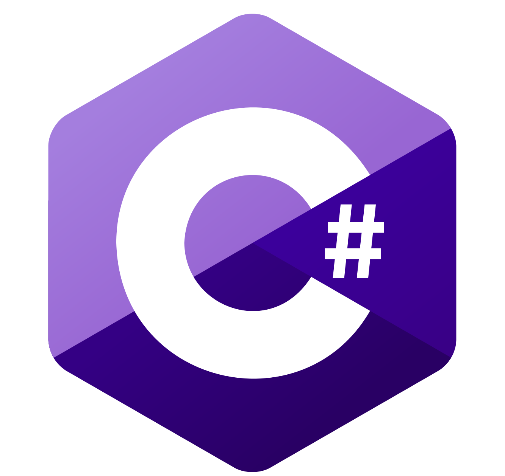
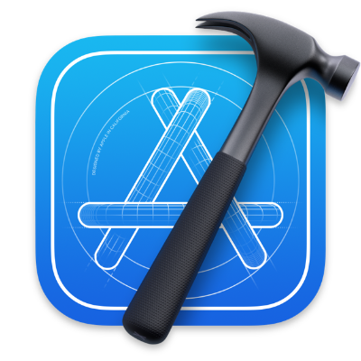

  

<h2></h2>

<h3>Olá, meu nome é Tainá Carazzato. Seja bem vindo!</h3>

- 🎓 Estudando Informática no Colégio Técnico de Campinas - Unicamp (COTUCA).
- 👽 Meus pronomes são: Ela/Dela.
- 🎮 Lvl 18 - XX/XX/2005
- 🌱 Explorando novas tecnologias e desenvolvendo soluções de software.
- 💻 Tenho interesse em desenvolvimento web, mobile e jogos.

- <h4>Entre em Contato:</h4>

 &nbsp;

  
## 💻 Linguagens e Ferramentas

| Categoria       | Habilidades                                     |
|----------------|--------------------------------------------|
| Programação    |         |
| Front-end      |                              |
| Back-end       |                     |
| Banco de Dados      |                           |
| Version Control|                              |
| Ferramentas    |     
| UI/UX          |                                 |

## Estatísticas

  
  

<!---

  

TainaCarazzato/TainaCarazzato is a ✨ special ✨ repository because its `README.md` (this file) appears on your GitHub profile.
You can click the Preview link to take a look at your changes.
--->
